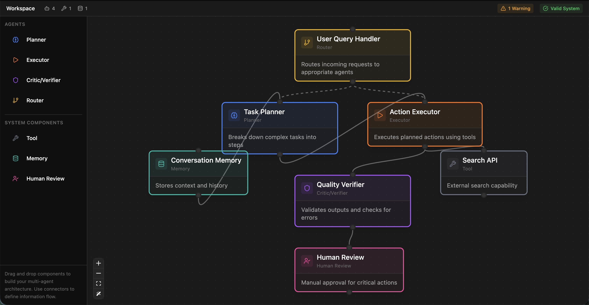

# PersonaFlow

**Visual System Designer for Multi-Agent AI Systems**

PersonaFlow is a design-time, canvas-first tool where engineers can map agents, tools, memory, and human checkpoints to visualize and reason about multi-agent AI architectures before implementation.



## Features

- **Visual Canvas Editor**: Drag-and-drop interface built with React Flow for designing agent architectures
- **Multiple Agent Types**: Support for Planners, Executors, Critics/Verifiers, and Routers
- **System Components**: Add Tools, Memory stores, and Human Checkpoints to your designs
- **Static Analysis Engine**: Real-time warnings for common architectural issues:
  - Unverified Executors (no downstream Critic or Human Checkpoint)
  - Unused Memory (read-only or write-only memory nodes)
  - Unbounded Loops (cycle detection in the graph)
- **Component Details Panel**: View and configure node properties, risks, and logic
- **Dark Theme**: Modern, developer-friendly dark UI

## Non-Goals

PersonaFlow is intentionally **NOT**:
- An agent runtime or execution engine
- A chat UI or conversational interface
- An AI/LLM API integration tool

This app is purely about **design and reasoning**, not execution.

## Tech Stack

- **React 19** with TypeScript
- **Vite** for fast development and builds
- **Tailwind CSS v4** for styling
- **React Flow** for the node-based canvas
- **Jotai** for atomic state management
- **Lucide React** for icons

## Getting Started

### Prerequisites

- Node.js 18+ 
- npm or yarn

### Installation

```bash
# Clone the repository
git clone https://github.com/yourusername/personaflow.git
cd personaflow

# Install dependencies
npm install

# Start development server
npm run dev
```

The app will be available at `http://localhost:5173`

### Build for Production

```bash
npm run build
npm run preview
```

## Project Structure

```
src/
├── atoms/           # Jotai atoms for state management
├── analysis/        # Static analysis engine
├── components/
│   ├── editor/      # Editor components (Canvas, Sidebar, etc.)
│   │   └── nodes/   # Custom React Flow node components
│   └── layout/      # App layout components
├── data/            # Example graphs
├── pages/           # Route pages
└── types/           # TypeScript type definitions
```

## Usage

### Adding Nodes

1. Drag a component from the left sidebar onto the canvas
2. Connect nodes by dragging from the bottom handle to another node's top handle
3. Click a node to view its details in the right panel

### Node Types

**Agents:**
- **Planner**: Decomposes goals into sub-tasks
- **Executor**: Executes tools and API calls
- **Critic/Verifier**: Validates agent outputs
- **Router**: Routes requests to appropriate agents

**System Components:**
- **Tool**: External tool or API integration
- **Memory**: Persistent storage for context
- **Human Review**: Human-in-the-loop checkpoint

### Understanding Warnings

The analysis engine provides real-time feedback:

- **Unverified Executor**: An Executor node should have a downstream Critic or Human Checkpoint to verify its outputs
- **Unused Memory**: Memory nodes should have both incoming (write) and outgoing (read) connections
- **Possible Loop**: Cycles in the graph may indicate unbounded recursion

## Contributing

Contributions are welcome! Please feel free to submit a Pull Request.

## License

MIT License
